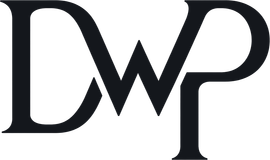

<div align="center">

<picture>
  <source media="(prefers-color-scheme: dark)" srcset="./assets/dwp-mark-dark.png" />
  
</picture>

# DeepWorkPlan Skill Pack

**Models matter. Context matters more.**

[](LICENSE)
[](https://agentskills.io)
[](https://skills.sh)

[🌐 deepworkplan.com](https://deepworkplan.com) · [🔒 Security](SECURITY.md) · [📝 Changelog](CHANGELOG.md) · [🤝 Contributing](CONTRIBUTING.md)

</div>

---

> The official DeepWorkPlan agent skill pack, maintained by [Dailybot](https://www.dailybot.com).

DeepWorkPlan turns any repository into a **structured environment** — context,
guardrails, and a durable plan — where any coding agent executes with precision
and finishes long-horizon work. It makes the repo AI-first (an adapted
`AGENTS.md`, `docs/`, per-module docs, and `.agents/` config), then drives
structured, multi-task **Deep Work Plans**: plan, execute, refine, resume, and
report on long-running work, with all plan output living in a gitignored
`.dwp/` directory.

> DeepWorkPlan is spec-driven development where the repository itself becomes the harness.

- **License:** [MIT](LICENSE)
- **Security policy:** [SECURITY.md](SECURITY.md)
- **Changes:** [CHANGELOG.md](CHANGELOG.md)
- **Format:** [Open Agent Skills](https://agentskills.io) standard
- **Docs:** <https://deepworkplan.com>

## Skills

| Skill | What it does |
|-------|-------------|
| **deepworkplan-onboard** | Make any repo AI-first. Reasons about the repo's stack and archetype (orchestrator hub vs individual repo), then generates an adapted `AGENTS.md`, `docs/`, per-module docs, `.agents/`, and the `.claude → .agents` symlink. Offers opt-in addons. |
| **deepworkplan-create** | Create a Deep Work Plan. Gathers context, drafts, and refines into a single final plan under `.dwp/plans/`, with the refined draft staged in `.dwp/drafts/`. |
| **deepworkplan-execute** | Execute an existing plan task-by-task, run each task's validation, and log progress. |
| **deepworkplan-refine** | Refine a plan draft, or modify the scope/tasks of an existing final plan. |
| **deepworkplan-resume** | Resume an interrupted plan from its recorded progress state. |
| **deepworkplan-status** | Report the status of a plan — completed tasks, what's left, and blockers — without executing. |
| **deepworkplan-author** | Author or update reusable skills, agents, and commands in the current repo — reasons about the repo's `.agents/` layout, follows the Open Agent Skills frontmatter contract, and keeps the `.agents/docs/` catalog in sync. Backs the `/skill-create` and `/agent-create` aliases. |

A root **deepworkplan** meta-skill acts as a router — it describes all
capabilities and routes to the right sub-skill based on the developer's intent.
Each skill can be used independently or together; they share context detection
through a common `shared/` directory. An opt-in **devcontainer addon** can layer
a reproducible dev container onto an onboarded repo.

## Install

### Option 1 — `npx skills` (cross-agent, recommended)

The [skills.sh](https://skills.sh) CLI auto-detects your agent and installs the
skill in the right place:

```bash
npx skills add DailybotHQ/deepworkplan-skill
```

To target a specific agent or list available skills first:

```bash
npx skills add DailybotHQ/deepworkplan-skill --list
npx skills add DailybotHQ/deepworkplan-skill -a claude-code
```

Installing at **project scope** writes an entry to a workspace-root
`skills-lock.json` so the exact skill version is reproducible across your team
(see [Reproducible installs](#reproducible-installs-skills-lockjson) below).

### Option 2 — OpenClaw native registry

```bash
openclaw skills install deepworkplan
```

OpenClaw loads the pack natively on every eligible session — no trigger setup
required.

### Option 3 — Git clone + setup script

Pick the path for your agent, clone, then run `setup.sh`:

| Agent | Default path |
|-------|--------------|
| Claude Code | `~/.claude/skills/deepworkplan/` |
| Cursor | `~/.cursor/skills/deepworkplan/` |
| OpenAI Codex | `~/.codex/skills/deepworkplan/` |
| Windsurf | `~/.codeium/windsurf/skills/deepworkplan/` |
| GitHub Copilot | `~/.copilot/skills/deepworkplan/` |
| Cline | `~/.cline/skills/deepworkplan/` |
| Gemini CLI | `~/.gemini/skills/deepworkplan/` |
| OpenClaw | `<workspace>/skills/deepworkplan/` or `~/.openclaw/skills/` |

```bash
git clone https://github.com/DailybotHQ/deepworkplan-skill.git ~/deepworkplan-skill
cd ~/deepworkplan-skill
./setup.sh                # auto-detect installed agents
./setup.sh --host claude  # or target one agent explicitly
```

`setup.sh` symlinks the `deepworkplan` pack plus each sub-skill
(`deepworkplan-create`, `deepworkplan-execute`, `deepworkplan-refine`,
`deepworkplan-resume`, `deepworkplan-status`, `deepworkplan-onboard`) into the
agent's skills directory so they're discoverable as independent slash commands.

### Invoke a skill

Once installed, describe what you want and the agent routes to the right
sub-skill:

- "Make this repo AI-first" / "onboard this repo" → **deepworkplan-onboard**
- "Create a plan to ship feature X" → **deepworkplan-create**
- "Execute the plan" / "continue the plan" → **deepworkplan-execute**
- "What's left on the plan?" → **deepworkplan-status**
- "Create a skill / agent" / "evolve the kit" → **deepworkplan-author** (also `/skill-create`, `/agent-create`)

Or invoke directly: `/deepworkplan-create`, `/deepworkplan-onboard`, etc.

## The `.dwp/` convention

All Deep Work Plan output lives in a gitignored `.dwp/` directory at the repo
root:

- `.dwp/plans/PLAN_<slug>/` — final plans (README + task files + progress log)
- `.dwp/drafts/` — refined drafts staged before becoming a final plan

`.dwp/` is resolved by `skills/deepworkplan/shared/context.sh` and overridable
via the `DWP_DIR` environment variable. It is meant to be gitignored — plan
artifacts are working state, not committed source. For orchestrator hubs, child
plans live at `repositories/<repo>/.dwp/plans/PLAN_<child>/`.

## Reproducible installs (`skills-lock.json`)

When you install at **project scope** (e.g. `npx skills add` run inside a
workspace), the skills.sh CLI writes the resolved skill source, path, and a
content hash to a `skills-lock.json` at your workspace root. Commit that file to
pin the exact version of DeepWorkPlan your team uses — re-running the installer
later restores the same revision. This skill repo does **not** ship a
`skills-lock.json` of its own; it is a consumer-side artifact that lives in
*your* workspace, not in the skill pack.

## Update

```bash
# npx
npx skills update DailybotHQ/deepworkplan-skill

# Git clone
cd <skill-path> && git pull && ./setup.sh

# OpenClaw
openclaw skills update deepworkplan
```

## Uninstall

```bash
# Remove the skill pack itself
rm -rf <skill-path>

# Remove sub-skill symlinks (Claude Code example)
rm -f ~/.claude/skills/deepworkplan \
      ~/.claude/skills/deepworkplan-create \
      ~/.claude/skills/deepworkplan-execute \
      ~/.claude/skills/deepworkplan-refine \
      ~/.claude/skills/deepworkplan-resume \
      ~/.claude/skills/deepworkplan-status \
      ~/.claude/skills/deepworkplan-onboard

# OpenClaw
openclaw skills remove deepworkplan
```

## Contributing

This README is for **users**. If you want to work on the skill itself, start with
[CONTRIBUTING.md](CONTRIBUTING.md) — the human-facing guide to local setup, the
auto-release flow, and the PR workflow. The canonical, terser rule list for AI
agents is [AGENTS.md](AGENTS.md) (and `CLAUDE.md` is a symlink to it): it covers
the ship boundary (only `skills/deepworkplan/` ships), the SKILL.md frontmatter
contract, the automatic-versioning rule, the commit format, and the pre-commit
checklist. Deeper background lives under [`docs/`](docs/) — [DESIGN.md](docs/DESIGN.md)
(the *why* behind the layout), [INSTALLATION.md](docs/INSTALLATION.md),
[OPENCLAW.md](docs/OPENCLAW.md), and [SUB_SKILL_GUIDE.md](docs/SUB_SKILL_GUIDE.md).

## Links

- [DeepWorkPlan](https://deepworkplan.com)
- [Dailybot](https://www.dailybot.com)
- [Open Agent Skills standard (agentskills.io)](https://agentskills.io)
- [skills.sh](https://skills.sh) — cross-agent skills directory

## :electric_plug: Powered by [Dailybot](https://www.dailybot.com?utm_source=dailybotopensource&utm_medium=deepworkplan-skill)

[Dailybot](https://www.dailybot.com/product/ai) is an AI-powered async communication platform that keeps **people and agents** visible — without adding more meetings or tools. It lives where your team already works (Slack, Teams, Google Chat, Discord, VS Code, and the CLI) and turns scattered signals into clear progress: async check-ins and standups, AI summaries that detect blockers and read team sentiment, workflow automation and approvals, team analytics, and recognition. As AI agents join the workflow, Dailybot surfaces their status and activity right alongside your team's — so long-running agents never go dark. [Learn more](https://www.dailybot.com?utm_source=dailybotopensource&utm_medium=deepworkplan-skill).
